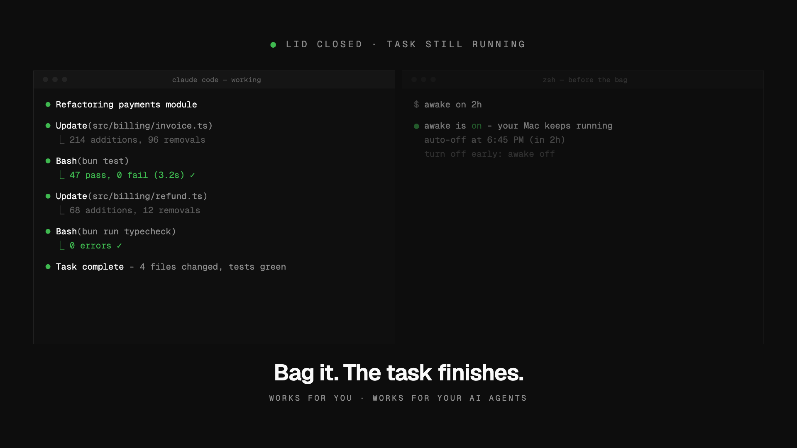

# awake

Keep your Mac running with the lid closed. Safe by default, built for humans and agents.

[](https://awake.crafter.run)

macOS force-sleeps a laptop when the lid closes, no matter what `caffeinate` says. The only switch that overrides it is `pmset -a disablesleep 1`, which needs root. `awake` wraps that switch with the ergonomics and guardrails it deserves:

- **Auto-off timer by default.** `awake on` keeps the Mac awake for 1 hour and then restores normal sleep on its own (via a `launchd` agent), so a forgotten toggle cannot drain your battery overnight.
- **One-time passwordless setup.** `awake setup` installs a sudoers rule scoped to exactly two commands (`pmset -a disablesleep 1` and `... 0`) - nothing else gets elevated, and `awake setup --uninstall` removes it.
- **Visible state.** The menu bar app shows a sun icon plus a live countdown while active, and notifies when the auto-off fires.
- **Agent-friendly.** Every command supports `--json`, output follows a stable envelope, and exit codes are meaningful.

## Install

```bash
bun install
bun run link:global      # builds and links the `awake` command
awake setup              # one-time: authorizes passwordless toggling
```

## Usage

```bash
awake on            # stay awake for 1 hour (default)
awake on 3h         # stay awake for 3 hours ("30m", "1h30m", "45" = minutes)
awake on --forever  # no timer - until you run awake off
awake off           # restore normal sleep now
awake status        # current state, timer, battery
```

## Menu bar app

A native SwiftUI menu bar companion (macOS 13+) that drives the same CLI:

```bash
./mac/build-app.sh
open mac/dist/Awake.app
```

- Moon icon: off. Sun icon + countdown (e.g. `42m`): the Mac is being kept awake.
- Toggle on for 30 min / 1 h / 2 h / until turned off; turn off any time.
- In "forever" mode it reminds you every 30 minutes that it is still on.
- Add it to System Settings > General > Login Items to start at login.

## For agents

`awake` is designed to be driven by coding agents (Claude Code, scripts, CI on self-hosted Macs). See [AGENTS.md](AGENTS.md) for the full contract. The short version:

```bash
awake on 2h --json     # keep the machine up for a long task
awake status --json    # {"data":{"enabled":true,"until":"...","remaining_seconds":...}}
awake off --json       # done early - restore normal sleep
```

- Success envelope: `{"data": {...}}` on stdout. Errors: `{"error": {"code", "message", "hint"}, "data": null}` on stderr.
- Exit codes: `0` success, `1` error, `3` setup required (a human must run `awake setup` once in a terminal).
- Output is JSON automatically when piped; `--json` forces it.

## How it works

- `awake on` runs `sudo -n pmset -a disablesleep 1` (allowed passwordless by the sudoers rule from setup), records state in `~/Library/Application Support/awake/`, and installs a `launchd` agent (`com.crafterstation.awake.autooff`) that runs `awake off --if-expired` at the deadline - and also at login, in case the deadline passed while the machine was off.
- `awake off` flips the switch back, removes the launchd agent, and clears state.
- The menu bar app polls `awake status --json` and shells out to the same CLI for toggles, so both surfaces always agree.

## Safety notes

- With awake on, closing the lid and tossing the Mac in a bag keeps it running (heat, battery). That is why the default is a 1-hour timer and `--forever` warns loudly.
- `awake status` warns when running on battery power.
- The sudoers rule never allows arbitrary `pmset`, only the two exact disablesleep commands.

## License

MIT
